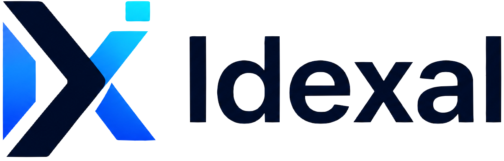

<p align="center">
  <a href="https://agents.idexal.com">
    
  </a>
</p>

<h1 align="center">idexla Agents AI Web UI — Free OpenSource</h1>

<p align="center">
  <strong>Open-source, AI-powered IDE. Everything-is-a-plugin. Built on Cordis. 100% Free, Forever.</strong>
</p>

<p align="center">
  <a href="https://github.com/idexal/agents"></a>
  <a href="https://github.com/idexal/agents/blob/master/LICENSE"></a>
  <a href="https://agents.idexal.com"></a>
  <a href="https://github.com/idexal/agents/releases"></a>
</p>

<p align="center">
  <a href="README.md">English</a> | <a href="README.zh.md">中文</a> | <a href="https://agents.idexal.com">Documentation</a> | <a href="https://idexal.com">idexal.com</a>
</p>

<p align="center">
  <em>by <a href="https://zakariaelahbabi.com">Zakariae Lahbabi</a> — Founder, CEO & Lead Developer @ <a href="https://idexal.com">Idexal</a></em>
</p>

---

> **idexla Agents AI Web UI** is a free and open-source, AI-powered IDE that competes with the best proprietary solutions — accessible to every developer on every platform. No paywalls. No feature gating. MIT licensed and community-driven to stay free forever.

Built on an **everything-is-a-plugin** architecture and powered by [Cordis](https://github.com/cordiverse/cordis), whose design is described in [_A Programming Paradigm for Spatiotemporal Composability_](https://arxiv.org/abs/2608.25512).

**🌐 Live:** [https://agents.idexal.com](https://agents.idexal.com) — **📦 Repo:** [https://github.com/idexal/agents](https://github.com/idexal/agents)

---

## ✨ Why idexla Agents?

| Feature | Description |
|---------|-------------|
| **🆓 Free Forever** | MIT licensed. No premium tier, no hidden costs. Community-owned to remain free. |
| **🧩 Everything is a Plugin** | Every feature is a Cordis plugin — deeply customizable, composable, hackable. |
| **🤖 Multi-Provider AI** | Bring your own API keys, gateways, or local models. No vendor lock-in. |
| **🌐 Web UI + Desktop + CLI** | Web, desktop (Electron + Rust), and terminal — same harness, same memory. |
| **⚡ Blazing Fast** | Rust engine, Monaco Editor, streamlined Web UI. |
| **🔌 Ecosystem** | `idexal-plugin` topic for discoverability. Write once, run everywhere. |
| **🔒 Transparent & Auditable** | 100% open source, auditable, self-hostable. |

---

## 🚀 Quick Start

### Run from `npm` (recommended)

Requires Node.js ^22.19 or >=24:

```sh
npx @deepseek-ai/dsh web
```

Starts the Web UI at `http://127.0.0.1:3080` and opens it in your browser. Use `--no-open` to skip auto-open. See [Web UI guide](docs/user/guide/index.md).

### Run from source

```sh
git clone https://github.com/idexal/agents.git
cd agents
pnpm install
pnpm run build
pnpm dsh web
```

`pnpm run build` prepares artifacts; `pnpm dsh web` runs them without rebuilding.

---

## 🏗️ Architecture

- **Cordis** — spatiotemporal plugin host (every contribution via `ctx.effect()`/`ctx.on()`)
- **Session & Agent Loop** — durable session data, projection, and loop hygiene
- **Capability Seams** — `Service Definition / Provider / Consumer` triads (LLM, FS, shell, terminal, web, LSP, ... )
- **Packages:** `packages/core`, `api`, `llm`, `shell`, `fs`, `web`, `skill`, `subagent`, `workflow`, `session`, and 30+ more

Start with [docs/architecture.md](docs/architecture.md) and [docs/development.md](docs/development.md). For agents, see [AGENTS.md](AGENTS.md).

---

## 🖥️ Idexal Ecosystem

| Project | Description | Links |
|---------|-------------|-------|
| **idexla Agents AI Web UI** | This repo — free AI-powered Web IDE | [github.com/idexal/agents](https://github.com/idexal/agents) • [agents.idexal.com](https://agents.idexal.com) |
| **Idexal IDE** | Desktop IDE (Electron + React + Monaco + Rust) | [github.com/idexal/idexal-ide](https://github.com/idexal/idexal-ide) |
| **Idexal CLI** | Terminal-first AI coding assistant | [github.com/idexal/idexal-cli](https://github.com/idexal/idexal-cli) |
| **Idexal Skills** | 118+ production-ready agent skills | [github.com/idexal/idexal-skills](https://github.com/idexal/idexal-skills) |
| **Idexa CoWork** | Agentic OS & everything-app | *coming soon* |

All MIT licensed. One harness, your choice of AI.

---

## 💝 Support the Project — Keep it Free Forever

**idexla Agents will always be free and open source.** To keep it that way we need your help:

- ⭐ **Star** this repo to increase visibility
- 💖 **Sponsor** on GitHub Sponsors — see [FUNDING.yml](.github/FUNDING.yml)
- 🤝 **Contribute** code, docs, translations, or plugins (see [CONTRIBUTING.md](CONTRIBUTING.md))
- 📣 **Share** with colleagues, write tutorials, add `idexal-plugin` to your plugin repos
- 🐛 **Report** bugs & ideas in [GitHub Discussions](https://github.com/idexal/agents/discussions) / [Issues](https://github.com/idexal/agents/issues)

> Every sponsorship, star, and contribution directly funds development, hosting, and keeps this project 100% free for everyone — students, indie hackers, and enterprises alike.

**Sponsor links:** [GitHub Sponsors](https://github.com/sponsors/idexal) • [info@idexal.com](mailto:info@idexal.com) • [idexal.com](https://idexal.com)

See [SUPPORT.md](SUPPORT.md) for support channels and [SECURITY.md](SECURITY.md) for security reporting.

---

## 🤝 Contributing

We welcome contributions of all kinds! Please see:

- [CONTRIBUTING.md](CONTRIBUTING.md) — how to contribute
- [CODE_OF_CONDUCT.md](CODE_OF_CONDUCT.md) — community standards
- [SUPPORT.md](SUPPORT.md) — where to get help
- [SECURITY.md](SECURITY.md) — how to report vulnerabilities

Add `idexal-plugin` to your plugin repository for discoverability.

---

## 👥 About Idexal

**Idexal** builds open-source, AI-powered developer tools that compete with the best proprietary solutions.

**Leadership — Zakariae Lahbabi**
Founder, CEO & Lead Developer. Passionate about building world-class developer tools for every developer on every platform.

- 🌐 [zakariaelahbabi.com](https://zakariaelahbabi.com)
- ✉️ [info@zakariaelahbabi.com](mailto:info@zakariaelahbabi.com)
- ⚡ GitHub [@idexal](https://github.com/idexal) • [@LahbabiCode](https://github.com/LahbabiCode)
- 🌐 [agents.idexal.com](https://agents.idexal.com) • [idexal.com](https://idexal.com)
- ✉️ [info@idexal.com](mailto:info@idexal.com) • [team@idexal.com](mailto:team@idexal.com)

---

## ⚠️ Developer Preview & Safety

Idexal Agents is in **developer preview** and iterates rapidly — **breaking changes may occur**.

The software can execute model-generated code, load third-party plugins, and access network/processes/files. Review [SAFETY.md](SAFETY.md) before running.

Use with least privilege, prefer disposable environments, keep backups, and review plugins/commands before approval.

---

## 📄 License

[MIT](LICENSE) — Copyright (c) 2026 Idexal / Zakariae Lahbabi

Third-party licenses in [THIRD_PARTY_NOTICES.md](THIRD_PARTY_NOTICES.md).

---

<p align="center">
  <a href="https://agents.idexal.com"></a><br>
  <strong>idexla Agents AI Web UI</strong> — Free OpenSource, Forever<br>
  Built with ❤️ by <a href="https://idexal.com">Idexal</a> • <a href="https://zakariaelahbabi.com">Zakariae Lahbabi</a><br>
  <em>Free for students • Free for indie hackers • Free for enterprises • Free for everyone</em>
</p>

<p align="center">
  <a href="https://github.com/idexal/agents">⭐ Star on GitHub</a> •
  <a href="https://github.com/sponsors/idexal">💖 Sponsor</a> •
  <a href="https://agents.idexal.com">📚 Docs</a> •
  <a href="https://github.com/idexal/agents/discussions">💬 Discussions</a>
</p>
